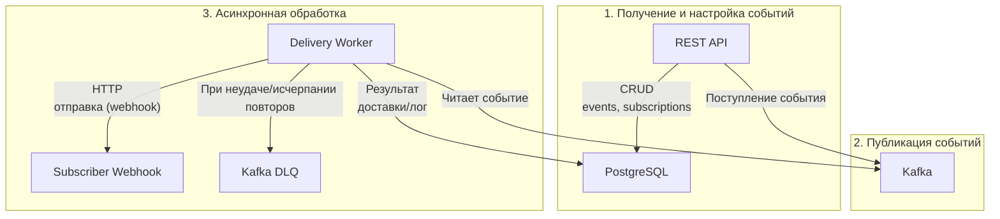

# EventConfigService

## Описание

**EventConfigService** — это production-ready сервис для управления конфигурациями событий и подписками, с интеграцией:  
- PostgreSQL как основной базы данных
- Apache Kafka в роли брокера событий
- REST API для управления
- Гибкой системой подписок и отправкой webhooks подписчикам

Сервис проектируется для высокой производительности, отказоустойчивости, горизонтального масштабирования и легко встраивается в производственную инфраструктуру.

---

## Архитектура

### Компоненты

1. **REST API**
    - Управление событиями, конфигами, подписками (CRUD).
    - Авторизация и аутентификация (например, OAuth2/JWT, настройки — отдельно).

2. **PostgreSQL**
    - Основное хранилище всех сущностей: событий, подписок, webhooks, логов доставок.
    - Использование миграций (Flyway или Liquibase).

3. **Apache Kafka**
    - Все входящие события публикуются в соответствующие топики в Kafka.
    - Отдельные воркеры (или сервисы) читают события из топиков и осуществляют отправку webhooks подписчикам.

4. **Delivery Worker**
    - Асинхронно обрабатывают события из Kafka.
    - Масштабируются отдельно от API.
    - Гарантируют идемпотентность обработки и поддержку повторных отправок (retry).
    - Неудачные доставки попадают в Dead Letter Queue (DLQ) Kafka для дальнейшего анализа/повторной обработки.

5. **Webhooks**
    - Каждый подписчик может указать собственный endpoint.
    - Отправка происходит в фоне, c поддержкой retry, таймаутами и логированием результатов.

6. **Мониторинг, аудит, логирование**
    - Интеграция с Prometheus/Grafana — метрики и алёрты.
    - Логи и аудит действий и доставок (ELK или любая другая стека логирования).

---

### Взаимодействие компонентов

Диаграмма ниже отображает основные каналы обмена данных между сервисами:

> _Если ваш markdown-ридер или платформа не поддерживает Mermaid, вы увидите просто текстовый блок._  
> На GitHub и GitLab визуализация будет работать "из коробки".

---

## Ключевые особенности готового решения

- **Отказоустойчивость**  
  Использование Kafka обеспечивает надёжную доставку и автоматический retry при сбоях, PostgreSQL — дублирование/резервное копирование данных.

- **Масштабируемость**  
  Сервис и Delivery Worker масштабируются независимо (горизонтально), при увеличении нагрузки достаточно добавить инстансы воркеров/API.

- **Безопасность**  
  Все доступы по API защищены, секреты для подписчиков и интеграций хранятся за пределами исходного кода (Vault, Secret Manager, переменные окружения).

- **Аудит и мониторинг**  
  Внедрение систем сбора и визуализации метрик, детальное логирование всех операций, историй доставок и ошибок.

- **Идемпотентность**  
  Доставка webhooks построена так, чтобы повторяющиеся события не приводили к дублирующей обработке на стороне подписчика.

---

## Запуск и развертывание

1. **Настроить окружение**:  
   - `application.yml` должен содержать ссылки на PostgreSQL и Kafka брокер.
   - Переменные окружения для базовых секретов (ключи webhooks, доступ к брокеру, БД).

2. **Миграции базы**:  
   - Запуск через Flyway/Liquibase.

3. **Сборка проекта**:  
   - `./gradlew build`  
     Запустит backend и worker как отдельные процессы (или docker-compose для прода).

4. **Мониторинг/Логи**:  
   - Конфигурируется отдельно (Prometheus/Grafana, ELK).

5. **Масштабирование**  
   - Количество воркеров отправки подбирается исходя из нагрузки (разворачивание новых экземпляров через оркестратор - Kubernetes, Docker Swarm и др.).

---

## Производственные best practices

- Настройте healthchecks (liveness + readiness probes).
- Включите автоматическое резервное копирование базы.
- Контролируйте потребление из Kafka — мониторьте отставание/lag.
- Отключайте/приостанавливайте “мертвых” подписчиков.
- Храните всю конфигурацию не в исходниках, а в внешних vault/secret manager.
- Используйте версионирование API для плавных обновлений.

---

## Пример окружения

- **База**: PostgreSQL 15+
- **Брокер**: Apache Kafka 3+
- **Оркестрация**: Kubernetes (deployment/failover/rollback)
- **CI/CD**: GitHub Actions/GitLab CI/Jenkins (по вашему стеку)
- **Логирование**: ELK/Graylog/Sentry

---

## Дополнительно

- Описание API — в OpenAPI спецификации (`event-config-openapi.yaml`)
- Событийная схема — в AsyncAPI (`event-webhook-asyncapi.yaml`)
- Инструкции по запуску тестов — в разделе [Development](#development)

---

**Рекомендации:**

- Часть `mermaid` можно копировать прямо в любой раздел README.md, например, в раздел "Архитектура" или "Взаимодействие компонентов".
- Для корпоративных wiki или Confluence — проверьте, поддерживается ли Mermaid (некоторым понадобится плагин).
- Если потребуется экспортировать в PDF/Word — заранее проверьте, корректно ли рисуется схема.

Если нужна вставка схемы в конкретное место вашего README — напишите, куда, и я пришлю готовый фрагмент!